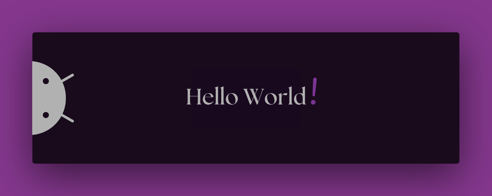

  

<!-- Imagem de banner -->

  <!-- Gráfico de linguagens mais usadas -->
  

  <!-- Links para redes sociais -->
  
  
  

  

# 💫 Sobre mim
* 🚀  4º semestre de ciência da computação
* ✉️  Me contate [ricardo.23.03.1749@gmail](mailto:ricardo.23.03.1749@gmail.com)
* 🧠  Estou aprendendo tudo de React
* 🖥️  Veja mais em [sites.google.com](https://sites.google.com/view/ricardoag/home)
* 🌍  Morando em Sorocaba, SP

 

### Habilidades

  <!-- Icones de habilidades -->
  
  
  
  
  
  
   
  
  
  
  

<!-- Imagem adicional -->

 

### Sistemas Operacionais

  <!-- Icones de sistemas operacionais -->
  
  
  
  
  
  
  

 

## 📊 Estatísticas do GitHub
> 📦 190.8 MB Usado no armazenamento do GitHub 
 > 
> 🏆 221 Contribuições no ano de 2024
 > 
> 📜 21 Repositórios Públicos 
 > 
> 🔑 7 Repositórios Privados 
 > 

